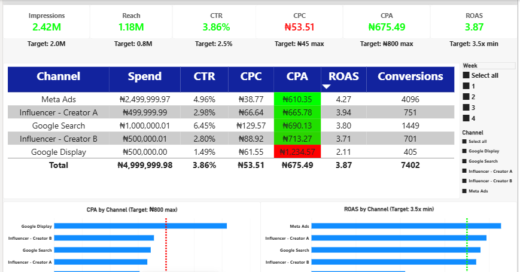
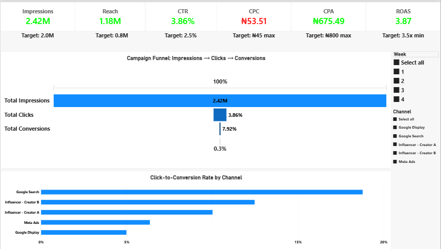
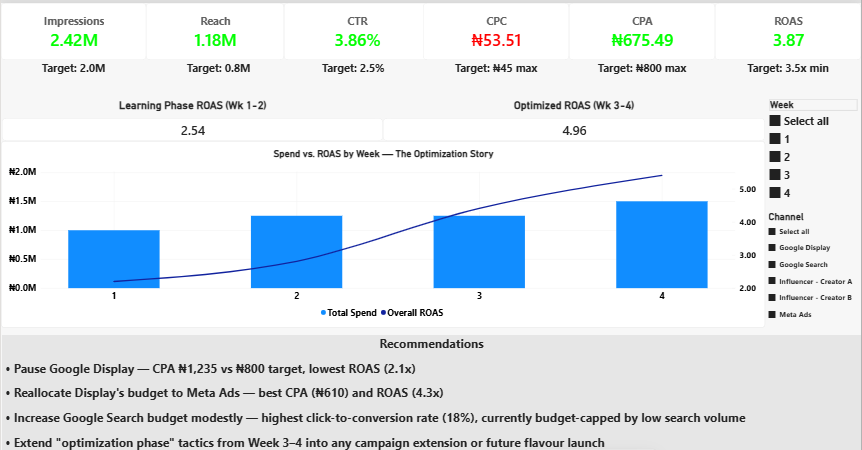

# FoodCo Nigeria — "The Secret Ingredient" Campaign Analysis

> **Note:** This is a self-initiated simulation project built to demonstrate an end-to-end analyst workflow — from campaign brief to client-facing report. FoodCo Nigeria, all data, and all figures are fictional. Built by Esibe Obokparo as an independent practice project.

## Overview

A simulated 4-week digital ad campaign for a fictional FMCG seasoning cube launch, built to demonstrate the full workflow of a marketing/data analyst role: market research → dataset design → BI dashboarding → client reporting → stakeholder communication.

**Campaign:** FoodCo Seasoning Cubes, new flavour launch
**Budget:** ₦5,000,000 over 4 weeks
**Channels:** Meta Ads, Google Search, Google Display, 2 Influencer partnerships
**Result:** 3.87x ROAS (target: 3.5x) — beat target on 5 of 6 KPIs

## Key Results

| KPI | Target | Actual | Result |
|---|---|---|---|
| Impressions | 2,000,000 | 2,418,372 | ✅ Beat |
| Reach | 800,000 | 1,179,214 | ✅ Beat |
| CTR | 2.5% | 3.86% | ✅ Beat |
| CPC | ≤ ₦45 | ₦53.51 | ⚠️ Above target |
| CPA | ≤ ₦800 | ₦675.49 | ✅ Beat |
| ROAS | ≥ 3.5x | 3.87x | ✅ Beat |

CPC ran above target due to competitive FMCG keyword and CPM costs in the Nigerian digital market — but strong conversion efficiency meant CPA and ROAS still cleared their targets. That trade-off is documented rather than smoothed over throughout this project.

## Dashboard

**Page 1 — Overview**


**Page 2 — Channel Performance**


**Page 3 — Conversion Funnel**


**Page 4 — Optimization Insights**


## Key Insights

- **Meta Ads was the standout channel** — lowest CPA (₦610) and highest ROAS (4.27x) — while **Google Display underperformed** (CPA ₦1,235, ROAS 2.11x) and is recommended for pause in any campaign extension.
- **Scale vs. intent quality:** Google Search converted the highest share of clicks (~18%) of any channel, but its low search volume caps how much budget it can absorb — Meta wins on scale, Search wins on intent quality. Two different kinds of channel wins, not a contradiction.
- **Optimization nearly doubled performance:** a deliberate two-week learning phase (ROAS 2.54x) was followed by data-led budget reallocation from Week 3 onward, closing the campaign at 4.96x ROAS in Weeks 3–4 — a 95% improvement.

## Repo Structure

```
01_campaign_brief/       Campaign brief & market research doc (Word)
02_raw_dataset/          Daily campaign dataset, 140 rows, live formulas (Excel)
03_dashboard/            Power BI dashboard (.pbix) + page screenshots
04_client_deck/          10-slide client report deck (PowerPoint)
05_summary_email/        Account manager summary email (.txt)
```

## Tools Used

Power BI Desktop (DAX, data modeling, dashboarding) · Excel · Microsoft Word · Microsoft PowerPoint

## Author

Esibe Obokparo — Data Analyst
[LinkedIn: obokparo-esibe](https://linkedin.com/in/obokparo-esibe) · [GitHub: Ruonaobos](https://github.com/Ruonaobos)
